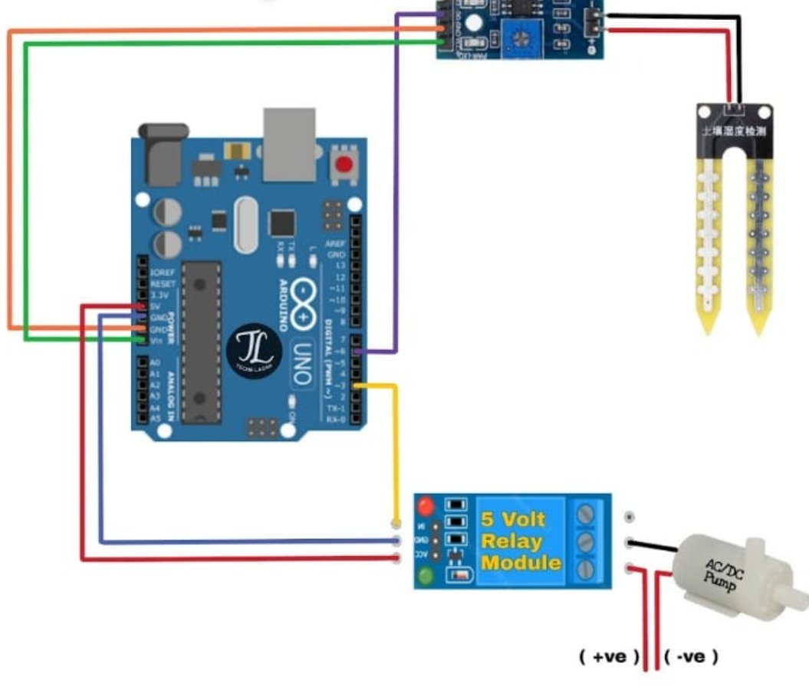

# Automatic Plant Watering System using Arduino

This Arduino-based system automates plant irrigation by monitoring soil moisture levels in real-time and activating a water pump via a relay module when the soil becomes too dry. Ideal for smart gardening and DIY home automation projects.

---

## Components Required

| No. | Component                     |
|-----|-------------------------------|
| 1.  | Arduino UNO                   |
| 2.  | 5V Relay Module               |
| 3.  | Water Pump and Tube/Pipe      |
| 4.  | Soil Moisture Sensor          |
| 5.  | Jumper Wires                  |

---

## How It Works

- The **soil moisture sensor** continuously monitors the water content of the soil.
- If the moisture level falls below a set threshold, the **relay module** turns on the **water pump**.
- Moisture readings and pump status are displayed on the **Serial Monitor**.
- The system ensures plants are watered only when necessary, preventing both over- and under-watering.

---

## Circuit Connections

| Arduino Pin      | Connected To            |
|------------------|--------------------------|
| A0               | Soil Sensor (Analog)     |
| D6               | Soil Sensor (Digital)    |
| D3               | Relay IN                 |
| 5V & GND         | Sensor + Relay Power     |

### Circuit Diagram

---

